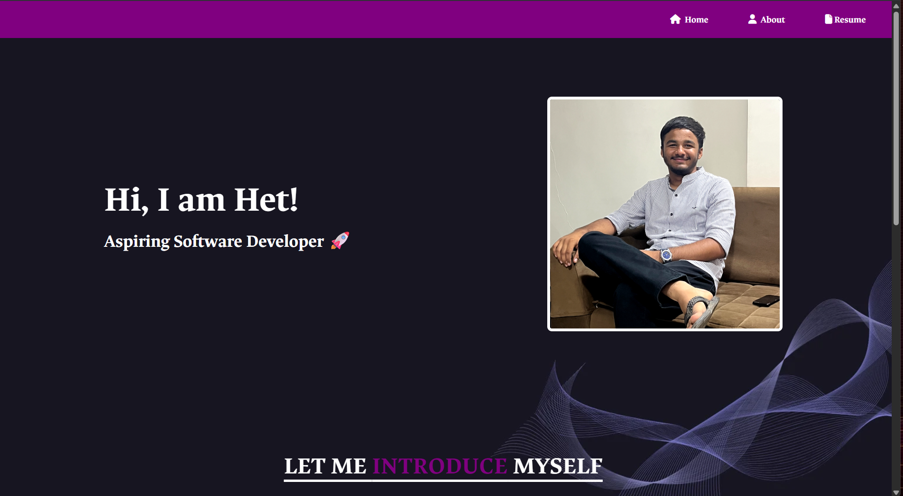
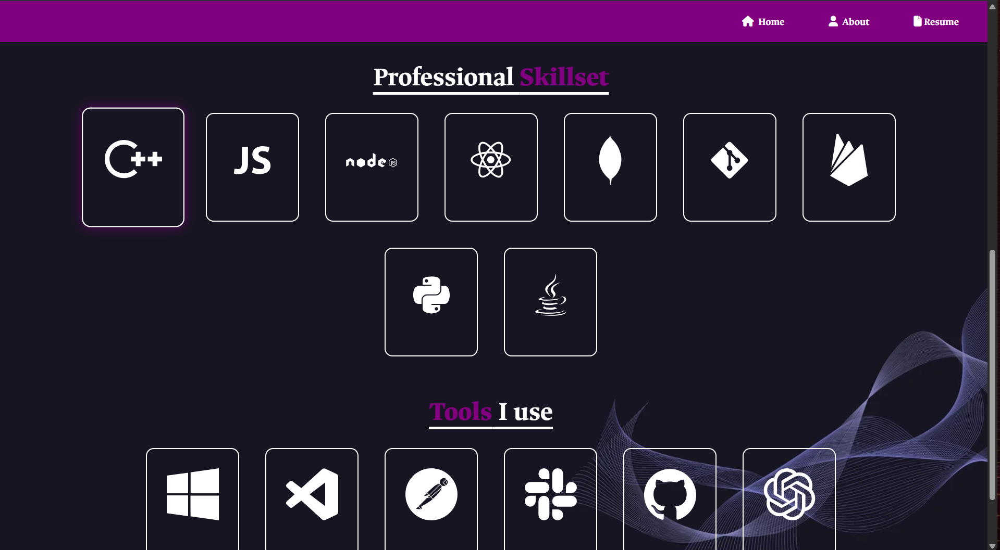

# Portfolio-Website
👋 Welcome to my portfolio website!  
This project serves as a digital showcase of my 💡 skills, 🎓 academic background, and 💻 hands-on experience in web development.  
It highlights my journey as a **Computer Engineering undergraduate**, featuring selected 🛠️ projects, 🔧 technologies I work with, and 🤝 ways to connect with me.

## 📌 Live Demo

🔗 [View Live Website](https://hetp0511.github.io/het-portfolio.github.io/)

## Screenshots

---

## 🛠️ Tech Stack Used

## 🚀 About Me

🎓 I'm currently studying Computer Engineering and love learning by **building projects**, experimenting with **front-end and back-end technologies**.  

🧠 I'm curious, self-driven, and always open to **collaborating** on exciting ideas.

When I’m not coding, you’ll probably find me playing a game of **chess** — it keeps me **sharp, focused, and strategic**, both on and off the board ♟️🧩

---

## 🤝 Let's Connect!

I'm always excited to collaborate on interesting projects, share ideas, or just have a friendly tech chat. Feel free to reach out!  

- 📧 **Email**: [hetp1911@gmail.com](mailto:hetp1911@gmail.com)  
- 💼 **LinkedIn**: [linkedin.com/in/het-patel0511](https://www.linkedin.com/in/het-patel0511/)  
- 🌐 **Portfolio**: [hetp0511.github.io/het-portfolio.github.io](https://hetp0511.github.io/het-portfolio.github.io/)

